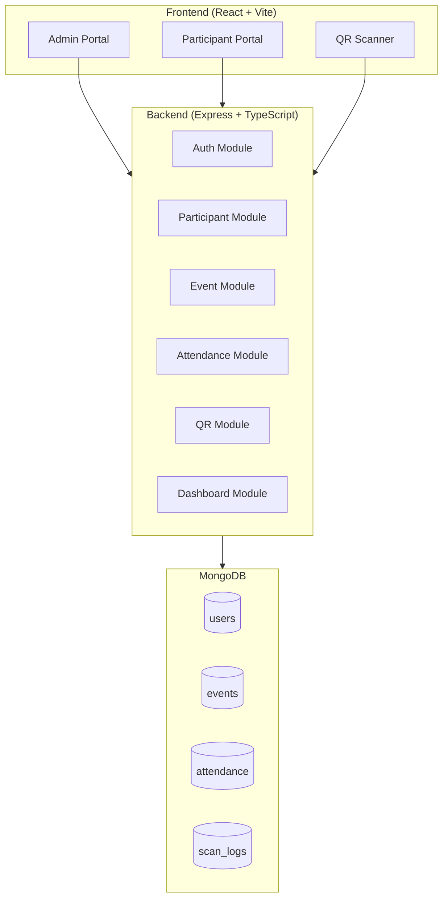
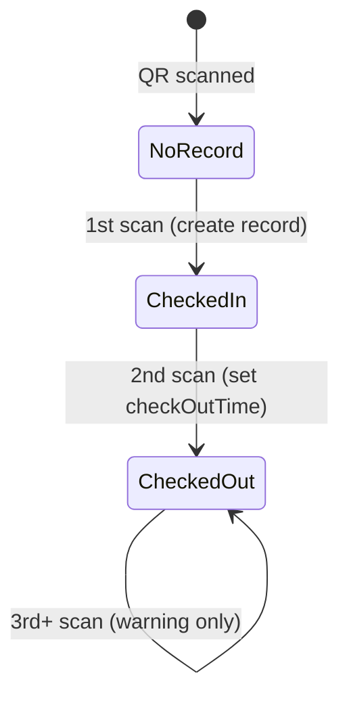
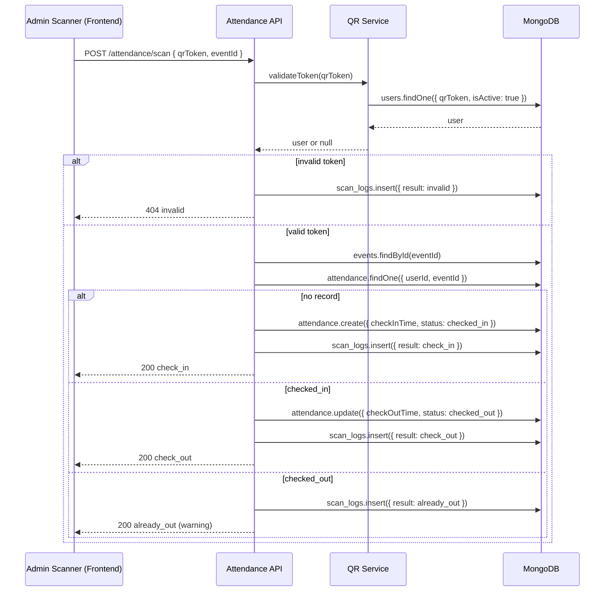

# QR Event Attendance Management System — MVP Architecture

Architecture for the QR Event Attendance Management System MVP, aligned with [doc.md](./doc.md) and the specified tech stack.

**Stack:** React + Vite + TypeScript + Ant Design + React Query (frontend) · Node.js + Express + TypeScript + MongoDB + Mongoose (backend)

---

## 1. System Overview



**Core flow:** Admin creates events and participants → system generates signed QR tokens → participant shows QR → scanner validates token → attendance service applies check-in / check-out rules → dashboard aggregates stats.

---

## 2. Folder Structure

```
qr-event-management/
├── README.md
├── ARCHITECTURE.md
├── doc.md
├── docker-compose.yml              # MongoDB + optional dev services
├── .env.example
│
├── backend/
│   ├── package.json
│   ├── tsconfig.json
│   ├── .env
│   └── src/
│       ├── index.ts                # App entry
│       ├── app.ts                  # Express app setup
│       ├── config/
│       │   ├── env.ts              # Env validation
│       │   ├── db.ts               # Mongoose connection
│       │   └── cors.ts
│       ├── constants/
│       │   ├── roles.ts
│       │   └── attendanceStatus.ts
│       ├── middleware/
│       │   ├── auth.ts             # JWT verification
│       │   ├── authorize.ts        # Role-based access
│       │   ├── validate.ts         # Request validation
│       │   ├── errorHandler.ts
│       │   └── rateLimiter.ts
│       ├── models/
│       │   ├── User.ts
│       │   ├── Event.ts
│       │   ├── Attendance.ts
│       │   └── ScanLog.ts
│       ├── routes/
│       │   ├── index.ts
│       │   ├── auth.routes.ts
│       │   ├── user.routes.ts
│       │   ├── event.routes.ts
│       │   ├── attendance.routes.ts
│       │   ├── qr.routes.ts
│       │   └── dashboard.routes.ts
│       ├── controllers/
│       │   ├── auth.controller.ts
│       │   ├── user.controller.ts
│       │   ├── event.controller.ts
│       │   ├── attendance.controller.ts
│       │   ├── qr.controller.ts
│       │   └── dashboard.controller.ts
│       ├── services/
│       │   ├── auth.service.ts
│       │   ├── user.service.ts
│       │   ├── event.service.ts
│       │   ├── attendance.service.ts
│       │   ├── qr.service.ts
│       │   └── dashboard.service.ts
│       ├── validators/
│       │   ├── auth.validator.ts
│       │   ├── user.validator.ts
│       │   ├── event.validator.ts
│       │   └── attendance.validator.ts
│       ├── utils/
│       │   ├── jwt.ts
│       │   ├── qrToken.ts          # HMAC-signed QR payload
│       │   ├── apiResponse.ts
│       │   └── pagination.ts
│       └── types/
│           ├── express.d.ts        # Augment Request with user
│           └── index.ts
│
└── frontend/
    ├── package.json
    ├── tsconfig.json
    ├── vite.config.ts
    ├── index.html
    └── src/
        ├── main.tsx
        ├── App.tsx
        ├── vite-env.d.ts
        ├── api/
        │   ├── client.ts           # Axios/fetch + interceptors
        │   ├── auth.api.ts
        │   ├── users.api.ts
        │   ├── events.api.ts
        │   ├── attendance.api.ts
        │   ├── qr.api.ts
        │   └── dashboard.api.ts
        ├── hooks/
        │   ├── useAuth.ts
        │   ├── useUsers.ts
        │   ├── useEvents.ts
        │   ├── useAttendance.ts
        │   └── useDashboard.ts
        ├── contexts/
        │   └── AuthContext.tsx
        ├── types/
        │   ├── auth.ts
        │   ├── user.ts
        │   ├── event.ts
        │   └── attendance.ts
        ├── utils/
        │   ├── storage.ts          # Token storage
        │   ├── formatDate.ts
        │   └── constants.ts
        ├── routes/
        │   ├── AppRoutes.tsx
        │   ├── ProtectedRoute.tsx
        │   └── RoleRoute.tsx
        ├── layouts/
        │   ├── AuthLayout.tsx
        │   ├── AdminLayout.tsx
        │   └── ParticipantLayout.tsx
        ├── pages/
        │   ├── auth/
        │   │   └── LoginPage.tsx
        │   ├── admin/
        │   │   ├── DashboardPage.tsx
        │   │   ├── ParticipantsPage.tsx
        │   │   ├── ParticipantDetailPage.tsx
        │   │   ├── EventsPage.tsx
        │   │   ├── EventDetailPage.tsx
        │   │   ├── AttendancePage.tsx
        │   │   └── ScannerPage.tsx
        │   └── participant/
        │       ├── MyQRPage.tsx
        │       └── MyAttendancePage.tsx
        └── components/
            ├── common/
            │   ├── PageHeader.tsx
            │   ├── LoadingSpinner.tsx
            │   ├── EmptyState.tsx
            │   └── ErrorBoundary.tsx
            ├── auth/
            │   └── LoginForm.tsx
            ├── participants/
            │   ├── ParticipantTable.tsx
            │   ├── ParticipantForm.tsx
            │   └── ParticipantCard.tsx
            ├── events/
            │   ├── EventTable.tsx
            │   ├── EventForm.tsx
            │   └── EventCard.tsx
            ├── qr/
            │   ├── QRDisplay.tsx
            │   └── QRScanner.tsx
            ├── attendance/
            │   ├── AttendanceTable.tsx
            │   ├── AttendanceStatusTag.tsx
            │   ├── ScanResultModal.tsx
            │   └── CheckInOutTimeline.tsx
            └── dashboard/
                ├── StatCard.tsx
                ├── AttendanceChart.tsx
                └── RecentActivityList.tsx
```

**Design principles:**

- Backend: thin controllers, business logic in services, validation at the edge.
- Frontend: pages orchestrate; components render; React Query owns server state; API layer is the single HTTP boundary.

---

## 3. MongoDB Collections

| Collection   | Purpose                              | Key Indexes                                      |
|--------------|--------------------------------------|--------------------------------------------------|
| `users`      | Staff accounts (auth)                | `login` (unique, sparse), `phone`                |
| `participants` | Event attendees (no auth)          | `phone`, `qrToken` (unique)                      |
| `events`     | Event metadata                       | `eventDate`, `status`, `createdBy`               |
| `attendance` | One record per user per event        | Compound unique: `{ userId, eventId }`           |
| `scan_logs`  | Audit trail for every scan attempt   | `{ eventId, scannedAt }`, `{ userId }`           |

### Collection Schemas (logical)

#### users

| Field           | Type     | Notes                              |
|-----------------|----------|------------------------------------|
| `_id`           | ObjectId | PK                                 |
| `name`          | string   | Required                           |
| `login`         | string   | Required for staff; min 1 character, not email format |
| `phone`         | string   | Optional contact                   |
| `passwordHash`  | string   | Admin only (bcrypt)                |
| `organization`  | string   | Optional                           |
| `photoUrl`      | string   | Optional                           |
| `role`          | enum     | `admin` \| `participant`           |
| `qrToken`       | string   | Unique, opaque; embedded in QR     |
| `isActive`      | boolean  | Soft-disable                       |
| `createdAt` / `updatedAt` | Date | Timestamps                    |

#### events

| Field           | Type     | Notes                              |
|-----------------|----------|------------------------------------|
| `_id`           | ObjectId | PK                                 |
| `title`         | string   | Required                           |
| `description`   | string   | Optional                           |
| `location`      | string   | Required                           |
| `eventDate`     | Date     | Required                           |
| `status`        | enum     | `draft` \| `active` \| `closed`    |
| `createdBy`     | ObjectId | Ref → users                        |
| `createdAt` / `updatedAt` | Date | Timestamps                    |

#### attendance

| Field           | Type     | Notes                              |
|-----------------|----------|------------------------------------|
| `_id`           | ObjectId | PK                                 |
| `userId`        | ObjectId | Ref → users                        |
| `eventId`       | ObjectId | Ref → events                       |
| `checkInTime`   | Date     | Set on first scan                  |
| `checkOutTime`  | Date     | Set on second scan                 |
| `status`        | enum     | `checked_in` \| `checked_out`      |
| `createdAt` / `updatedAt` | Date | Timestamps                    |

#### scan_logs (audit / debugging)

| Field        | Type     | Notes                                           |
|--------------|----------|-------------------------------------------------|
| `_id`        | ObjectId | PK                                              |
| `userId`     | ObjectId | Resolved from QR                                |
| `eventId`    | ObjectId | Active event context                            |
| `scannedBy`  | ObjectId | Admin who scanned                               |
| `result`     | enum     | `check_in` \| `check_out` \| `already_out` \| `invalid` |
| `scannedAt`  | Date     | Timestamp                                       |
| `metadata`   | object   | Device info, IP (optional)                      |

---

## 4. Mongoose Models

### User Model

- **Schema fields:** name, login, phone, passwordHash, photoUrl, isSuperAdmin, isActive
- **Hooks:** pre-save → hash password (admin only), auto-generate `qrToken` on create
- **Methods:** `comparePassword(candidate)`
- **Statics:** `findByQrToken(token)`
- **Select:** `passwordHash` excluded by default (`select: false`)

### Event Model

- **Schema fields:** title, description, location, eventDate, status, createdBy
- **Refs:** `createdBy` → User
- **Indexes:** `{ eventDate: -1 }`, `{ status: 1 }`
- **Validation:** `eventDate` must be today or future on create (MVP rule)

### Attendance Model

- **Schema fields:** userId, eventId, checkInTime, checkOutTime, status
- **Refs:** userId → User, eventId → Event
- **Indexes:** unique compound `{ userId: 1, eventId: 1 }`
- **Validation:** checkOutTime > checkInTime when both set

### ScanLog Model

- **Schema fields:** userId, eventId, scannedBy, result, scannedAt, metadata
- **Refs:** userId, eventId, scannedBy → User
- **Indexes:** `{ eventId: 1, scannedAt: -1 }`
- **TTL:** optional 90-day TTL index for MVP log retention

---

## 5. API Endpoints

Base URL: `/api/v1`

### Authentication

| Method | Endpoint       | Auth   | Description                        |
|--------|----------------|--------|------------------------------------|
| POST   | `/auth/login`  | Public | Admin login → JWT                  |
| POST   | `/auth/logout` | Admin  | Client-side token discard          |
| GET    | `/auth/me`     | Any    | Current user profile               |

### Participants (Users)

| Method | Endpoint                      | Auth         | Description                              |
|--------|-------------------------------|--------------|------------------------------------------|
| POST   | `/users`                      | Admin        | Create participant (auto-generates QR)   |
| GET    | `/users`                      | Admin        | List participants (paginated, searchable)|
| GET    | `/users/:id`                  | Admin / Self | Get participant by ID                    |
| PUT    | `/users/:id`                  | Admin        | Update participant                       |
| DELETE | `/users/:id`                  | Admin        | Soft-delete (`isActive: false`)          |
| GET    | `/users/:id/qr`               | Admin / Self | Return QR image (PNG/SVG data URL)       |
| POST   | `/users/:id/regenerate-qr`    | Admin        | Invalidate old token, issue new one      |

### Events

| Method | Endpoint                | Auth  | Description                              |
|--------|-------------------------|-------|------------------------------------------|
| POST   | `/events`               | Admin | Create event                             |
| GET    | `/events`               | Admin | List events (filter by status/date)      |
| GET    | `/events/:id`           | Admin | Event detail + stats summary             |
| PUT    | `/events/:id`           | Admin | Update event                             |
| PATCH  | `/events/:id/status`    | Admin | Activate / close event                   |
| DELETE | `/events/:id`           | Admin | Delete (only if no attendance records)   |

### Attendance

| Method | Endpoint                        | Auth         | Description                    |
|--------|---------------------------------|--------------|--------------------------------|
| POST   | `/attendance/scan`              | Admin        | Scan QR → check-in/out logic   |
| GET    | `/attendance`                   | Admin        | List all attendance            |
| GET    | `/attendance/event/:eventId`    | Admin        | Attendance for specific event  |
| GET    | `/attendance/user/:userId`      | Admin / Self | User attendance history        |
| GET    | `/attendance/:id`               | Admin        | Single attendance record       |

### QR

| Method | Endpoint                  | Auth  | Description                              |
|--------|---------------------------|-------|------------------------------------------|
| GET    | `/qr/validate/:token`     | Admin | Validate token without recording         |

### Dashboard

| Method | Endpoint              | Auth  | Description              |
|--------|-----------------------|-------|--------------------------|
| GET    | `/dashboard/stats`    | Admin | Aggregate KPIs           |
| GET    | `/dashboard/recent`   | Admin | Recent scan activity     |

### Standard Response Envelope

```json
{
  "success": true,
  "data": {},
  "message": "optional",
  "meta": { "page": 1, "limit": 20, "total": 100 }
}
```

### Scan Endpoint Contract

**Request:** `POST /api/v1/attendance/scan`

```json
{
  "qrToken": "opaque-signed-token",
  "eventId": "event-object-id"
}
```

**Response outcomes:**

| Scenario      | HTTP | `result`       | Action                                      |
|---------------|------|----------------|---------------------------------------------|
| First scan    | 200  | `check_in`     | Create attendance, set `checkInTime`        |
| Second scan   | 200  | `check_out`    | Update attendance, set `checkOutTime`       |
| Third+ scan   | 200  | `already_out`  | No mutation; return warning                 |
| Invalid token | 404  | `invalid`      | Log scan, reject                            |
| Inactive user | 403  | `invalid`      | Reject                                      |
| Closed event  | 400  | —              | Reject                                      |

---

## 6. Frontend Pages

| Route                      | Page                   | Role        | Purpose                              |
|----------------------------|------------------------|-------------|--------------------------------------|
| `/login`                   | LoginPage              | Public      | Admin authentication                 |
| `/admin/dashboard`         | DashboardPage          | Admin       | KPI cards + recent activity          |
| `/admin/participants`      | ParticipantsPage       | Admin       | CRUD participant list              |
| `/admin/participants/:id`  | ParticipantDetailPage  | Admin       | Profile, QR preview, history         |
| `/admin/events`            | EventsPage             | Admin       | Event list + create                  |
| `/admin/events/:id`        | EventDetailPage        | Admin       | Event detail + live attendance       |
| `/admin/attendance`        | AttendancePage         | Admin       | Full attendance log with filters     |
| `/admin/scanner`           | ScannerPage            | Admin       | Camera-based QR scanner              |
| `/my/qr`                   | MyQRPage               | Participant | Display personal QR code             |
| `/my/attendance`           | MyAttendancePage       | Participant | Personal check-in/out history        |
| `/`                        | —                      | —           | Redirect based on role               |

### React Query Keys

| Key                                              | Invalidated on                        |
|--------------------------------------------------|---------------------------------------|
| `['auth', 'me']`                                 | Login / logout                        |
| `['users']`, `['users', id]`                     | Create / update / delete participant  |
| `['events']`, `['events', id]`                   | Create / update / status change       |
| `['attendance']`, `['attendance', 'event', eventId]` | Scan                              |
| `['dashboard', 'stats']`, `['dashboard', 'recent']` | Scan, participant/event mutations |
| `['qr', userId]`                                 | Regenerate QR                         |

---

## 7. Component Tree

```
App
└── QueryClientProvider
    └── AuthProvider
        └── BrowserRouter
            └── AppRoutes
                ├── AuthLayout
                │   └── LoginPage
                │       └── LoginForm
                │
                ├── AdminLayout                          [ProtectedRoute: admin]
                │   ├── Sider + Header (Ant Design Layout)
                │   │
                │   ├── DashboardPage
                │   │   ├── PageHeader
                │   │   ├── Row: StatCard × 4
                │   │   │   (Total / Checked-In / Checked-Out / Inside)
                │   │   ├── AttendanceChart
                │   │   └── RecentActivityList
                │   │
                │   ├── ParticipantsPage
                │   │   ├── PageHeader + Create Button
                │   │   ├── ParticipantTable
                │   │   └── ParticipantForm (Modal)
                │   │
                │   ├── ParticipantDetailPage
                │   │   ├── ParticipantCard
                │   │   ├── QRDisplay
                │   │   └── CheckInOutTimeline
                │   │
                │   ├── EventsPage
                │   │   ├── PageHeader + Create Button
                │   │   ├── EventTable
                │   │   └── EventForm (Modal)
                │   │
                │   ├── EventDetailPage
                │   │   ├── EventCard
                │   │   ├── StatCard row (event-scoped)
                │   │   └── AttendanceTable
                │   │
                │   ├── AttendancePage
                │   │   ├── Filters (event, status, date range)
                │   │   └── AttendanceTable
                │   │
                │   └── ScannerPage
                │       ├── EventSelector (active event picker)
                │       ├── QRScanner (html5-qrcode)
                │       └── ScanResultModal
                │
                └── ParticipantLayout                  [ProtectedRoute: participant]
                    ├── Header
                    │
                    ├── MyQRPage
                    │   ├── ParticipantCard
                    │   └── QRDisplay (large, downloadable)
                    │
                    └── MyAttendancePage
                        └── AttendanceTable (read-only, self-scoped)
```

### Shared Component Responsibilities

| Component            | Responsibility                                      |
|----------------------|-----------------------------------------------------|
| `QRDisplay`          | Renders QR from API data URL; download button       |
| `QRScanner`          | Camera access, decode, emit token to parent         |
| `ScanResultModal`    | Shows check-in/out/warning with participant info    |
| `AttendanceStatusTag`| Ant Design Tag colored by status                    |
| `StatCard`           | Reusable metric card for dashboard                  |
| `ProtectedRoute`     | Redirect to `/login` if unauthenticated             |
| `RoleRoute`          | Redirect if role mismatch                           |

---

## 8. Security Strategy

### 8.1 Authentication & Authorization

| Layer            | Strategy                                                                 |
|------------------|--------------------------------------------------------------------------|
| Admin auth       | Email + password → JWT (access token, 8h expiry)                        |
| Participant auth | MVP: admin-created accounts; self-service via QR view or phone+PIN      |
| Token storage    | `httpOnly` cookie preferred; fallback: `sessionStorage`                 |
| RBAC             | Middleware: `auth` → `authorize('admin')` per route                     |
| Self-access      | Participants can only read own profile, QR, and attendance              |

### 8.2 QR Token Security

| Concern              | Mitigation                                                       |
|----------------------|------------------------------------------------------------------|
| Predictable IDs      | Use `crypto.randomBytes(32)` opaque token, not user `_id`        |
| QR forgery           | Store token server-side; validate against DB on scan             |
| Token leakage        | Regenerate invalidates old token; optional HMAC in QR payload    |
| Replay at wrong event| Scan always requires `eventId` context; token alone insufficient |

**QR payload format (encoded in QR image):**

```
https://{app-domain}/scan?t={qrToken}
```

Scanner extracts `t`, sends to API with selected `eventId`.

### 8.3 API Security

| Control         | Implementation                                                    |
|-----------------|-------------------------------------------------------------------|
| Input validation| `express-validator` or Zod at route level                         |
| Rate limiting   | `/auth/login`: 5 req/min; `/attendance/scan`: 30 req/min per IP  |
| CORS            | Whitelist frontend origin only                                    |
| Helmet          | Security headers (CSP, X-Frame-Options)                           |
| NoSQL injection | Mongoose schema typing; never pass raw `req.query` to `$where`    |
| Error handling  | Generic 500 messages; log details server-side only                |
| File uploads    | MVP: URL-only `photoUrl`; no direct upload                        |

### 8.4 Data Protection

| Item       | Approach                                      |
|------------|-----------------------------------------------|
| Passwords  | bcrypt, cost factor 12                        |
| PII        | Phone numbers visible to admin only           |
| Soft delete| `isActive: false` preserves audit trail         |
| Audit      | `scan_logs` records every scan attempt          |

### 8.5 Frontend Security

| Control          | Implementation                              |
|------------------|---------------------------------------------|
| Route guards     | `ProtectedRoute` + `RoleRoute`              |
| Token refresh    | MVP: re-login on expiry                     |
| XSS              | React auto-escaping                         |
| Camera permission| Scanner page requests camera when mounted   |

### 8.6 Deployment Hardening (MVP baseline)

- HTTPS everywhere (TLS termination at reverse proxy)
- MongoDB auth enabled; not exposed publicly
- Environment secrets via `.env` (never committed)
- `NODE_ENV=production` disables stack traces
- Database backups: daily `mongodump` cron

---

## 9. Attendance State Machine



**Currently Inside** = `status === 'checked_in'` (checked in, not yet checked out).

---

## 10. Dashboard Metrics (computed server-side)

| Metric              | Query logic                                                       |
|---------------------|-------------------------------------------------------------------|
| Total Participants  | `users.count({ role: 'participant', isActive: true })`            |
| Checked-In          | `attendance.count({ status: 'checked_in' })` per event or global    |
| Checked-Out         | `attendance.count({ status: 'checked_out' })`                       |
| Currently Inside    | `attendance.count({ status: 'checked_in' })`                      |
| Recent Activity     | `scan_logs.find().sort({ scannedAt: -1 }).limit(10)`            |

Optional `eventId` query param scopes all metrics to one event.

---

## 11. Key Architectural Decisions

| Decision                              | Rationale                                              |
|---------------------------------------|--------------------------------------------------------|
| Monorepo (frontend + backend)         | Single repo; shared types possible in v2               |
| Service layer over fat controllers    | Testable business logic, especially scan rules         |
| `scan_logs` separate from `attendance`| Audit without polluting attendance records             |
| Compound unique index on attendance   | Prevents duplicate check-ins per user/event            |
| React Query over Redux                | Server-state caching fits CRUD + scan refresh patterns |
| Admin-only scanner                    | TRD flow; participants only display QR                 |
| No multi-tenant in MVP                | `organization` field is metadata only for now            |

---

## 12. Suggested Implementation Order

1. Backend scaffold + MongoDB connection + User/Event models
2. Auth (admin login, JWT middleware)
3. Participant CRUD + QR generation
4. Event CRUD
5. Attendance scan service + state machine
6. Dashboard aggregation endpoints
7. Frontend auth + admin layout
8. Participant & event management pages
9. QR display + scanner page
10. Dashboard + attendance log pages

---

## 13. Scan Flow Sequence Diagram



---

## 14. Environment Variables

### Backend (`.env`)

| Variable           | Description                          |
|--------------------|--------------------------------------|
| `PORT`             | Server port (default 3000)           |
| `MONGODB_URI`      | MongoDB connection string            |
| `JWT_SECRET`       | JWT signing secret                   |
| `JWT_EXPIRES_IN`   | Token expiry (e.g. `8h`)             |
| `QR_HMAC_SECRET`   | Optional HMAC secret for QR payloads |
| `CORS_ORIGIN`      | Frontend URL                         |
| `NODE_ENV`         | `development` \| `production`        |

### Frontend (`.env`)

| Variable           | Description                          |
|--------------------|--------------------------------------|
| `VITE_API_BASE_URL`| Backend API base URL                 |

---

*Estimated MVP build time: 2–3 days per [doc.md](./doc.md).*
